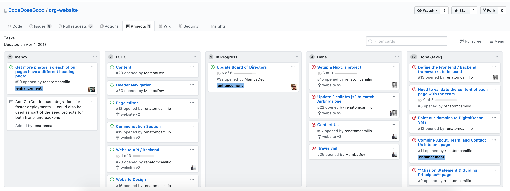
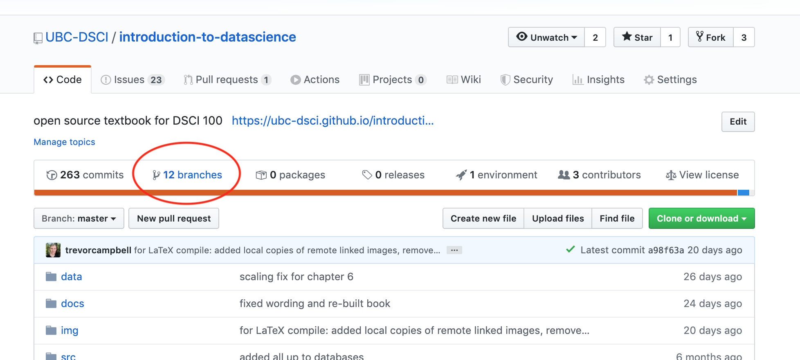

```python
from IPython.display import HTML
```

## DSCI 524 - Collaborative Software Development

### Lecture 1: Introduction & my goodness more git!

#### 2020-02-24

## High level goals of the course:

1. Develop high-quality software engineering skills so that we can create code that can be utilized widely by others.

2. Develop project management workflows and strategies that are effective for collaborative software development.

3. Learn and employ the social norms of open source, collaborative software development.

## Course Syllabus:

- https://github.ubc.ca/MDS-2019-20/DSCI_524_collab-sw-dev_students

## Lecture 1 learning objectives:

By the end of this lecture, students should be able to:
- [Create project boards using GitHub and link tasks to issues](#Project-boards) (20 min)
- [Create GitHub milestones to group related issues](#Milestones) (10 min)
- [Set-up master branch protection on a GitHub repository](#Master-branch-protection) (5 min)
- [Use branching and pull requests to propose changes to the master branch](#Branching) (20 min)
- [Compare and contrast the Git and GitHub flow development workflows](#Git-and-gitHub-flow) (15 min)

## Polls & Questions

We are going to test drive a new system for me to understand where you are at, and what Q's you might have! It's called [slido](https://www.sli.do/).

Why? There are a lot of you, and I'm finding it challenging to get a read on the overall state of the cohort. I like this tool because its dead simple, used at tech industry conferences (you will likely encounter it again) and I can do anonymous polls and Q's all in one platform. Note - I will poll you at the end of next week to see whether this is working for you or not.

Let's try this out! 

- Go to <https://www.sli.do/> and enter `#L01`
- answer the first poll

## Project boards (20 min)

Example of a physical [Kanban board](https://en.wikipedia.org/wiki/Kanban_board):


Source: <https://medium.com/@mli/lets-get-physical-task-boards-f9d08383e667>


### Discuss
Discuss with your neighbour why you might want to use a project board like this at work. If you have any experience doing this in the past, please share it with your neighbours.

---

Example of a digital project board from GitHub:

Reading: [About project boards - GitHub Help](https://help.github.com/en/github/managing-your-work-on-github/about-project-boards)



Source: <https://github.com/CodeDoesGood/org-website/projects/1>

### Discuss
Discuss with your neighbour why you might want to use a digital project board like this at work. If you have any experience doing this in the past, please share it with your neighbour.


### Why use project boards for collaborative software projects?

- **Transparency:** everyone knows what everyone is doing

- **Motivation:** emphasis on task completion

- **Flexibility:** board columns and tasks are customized to each project

### Exercise: Getting to know GitHub project boards

We are going to each create our own project board for our MDS homework. I have set-up a template GitHub repository for you so that you can easily populate it with relevant issues for your homework this block. You will use these issues to create your MDS homework project board.

#### Steps:

1. **Import** a copy of [this GitHub repository](https://github.com/UBC-MDS/mds-homework) (need help? see: [*How to import a GitHub repository*](https://help.github.com/en/github/importing-your-projects-to-github/importing-a-repository-with-github-importer))

2. Using the GitHub webpage, make a new branch called `create` in your copy of that repository (this will generate the issues for you).

3. Click on the Projects tab, and then click "Create a project". Give it a name, and select "Basic kanban" as the template option.

4. Use the issues in the repo to set-up a project board for the next two weeks (or more) of your MDS homework. For each issue you add to the project, assign it to yourself and add a label of "group-work" or "individual-work".

**When you are done step #4 indicate so on the [sli.do](https://www.sli.do) poll (`#L01`).**

Additional Resources:
- [Assigning issues and pull requests to other GitHub users](https://help.github.com/en/github/managing-your-work-on-github/assigning-issues-and-pull-requests-to-other-github-users)
- [Applying labels to issues and pull requests](https://help.github.com/en/github/managing-your-work-on-github/applying-labels-to-issues-and-pull-requests)

### Relevance to course project:

- You will be expected to create a project board for each of your groups projects and update it each milestone (at a minimum)

- We expect that each issue should have at least one person assigned to it

## Milestones (10 min)

- Group related issues together that are needed to hit a given target (e.g., new release version of a software package)

- Can assign a due date to a milestone

- From the milestone page you can see list of statistics that are relevant to each milestone set in that repository

Reading: [About milestones - GitHub Help](https://help.github.com/en/github/managing-your-work-on-github/about-milestones) 

Example of the `readr` package milestones:


Source: https://github.com/tidyverse/readr/milestones

### Exercise: Getting to know GitHub milestones

We are going to practice creating milestones and associating issues with them. To do this we will continue working with the same repository that you just created a project board for.

#### Steps:

1. Click on the Issues tab, and then click on "Milestones". 

2. Click "New milestone" and name it "week 1" and set the due date to be this Saturday. Click "Create milestone".

3. Go to the Issues tab, and for each issue that should be associated with the week 1 milestone (i.e., things due this Saturday), open that issue and set the milestone for that issue as "week 1".

4. Once you are done, go back to the Milestones page to view what the week 1 milestone looks like.

5. Now this for week 2.

**When you are done step #4 indicate so on the [sli.do](https://www.sli.do) poll (`#L01`).**


### Relevance to course project:

- You will be expected to create a milestone on each of your project repositories for each course assigned milestone. You must link the relevant issues needed to complete that milestone to it on GitHub.

## Master branch protection (5 min)

Once we have developed the first working version of our software (that will be the end of week 2 for us in this course), we want to consider our master branch as the **deployment** branch.

What do we mean by **deployment** branch? Here we mean that other people may be **using and depending** on it, and thus, if we push changes to master they **must not break things**!

How do I make sure changes won't break things? 

There are varying levels of checks and balances that can be put in place to do this. One fundamental practice is **master branch protection**. Here we essentially put a rule in place that no one can push directly to master, all changes to master must be sent via a pull request so that **at least** one entity (e.g., human) can check things over before the change gets applied to the master (i.e., deployment) branch.

Readings:
- [Configuring protected branches - GitHub help](https://help.github.com/en/github/administering-a-repository/configuring-protected-branches)
- [Best practices for protected branches](https://github.community/t5/Support-Protips/Best-practices-for-protected-branches/ba-p/10224).

#### How to accept a pull request on a GitHub repository that has master branch protection


```python
HTML('<iframe width="560" height="315" src="https://www.youtube.com/embed/kOE6b8zpfCY" frameborder="0" allowfullscreen></iframe>')
```

    /opt/anaconda3/lib/python3.7/site-packages/IPython/core/display.py:701: UserWarning: Consider using IPython.display.IFrame instead
      warnings.warn("Consider using IPython.display.IFrame instead")


<iframe width="560" height="315" src="https://www.youtube.com/embed/kOE6b8zpfCY" frameborder="0" allowfullscreen></iframe>


### Exercise: Setting up master branch protection

We are going to practice setting up master branch protection. Once we set this up on our play repository linked to below, we will practice branching and pull requests to send changes to the master branch in a later exercise.

#### Steps:

1. **Import** a copy of [this GitHub repository](https://github.com/ttimbers/sqrt) (need help? see: [*How to import a GitHub repository*](https://help.github.com/en/github/importing-your-projects-to-github/importing-a-repository-with-github-importer))

2. Add master branch protection to your copy of this repository (make sure you tick the box "Include administrators" to also apply this to folks with write access to the repo, i.e., you!).

3. Try to make a change by pushing directly to the master branch

**When you are done step #3 indicate so on the [sli.do](https://www.sli.do) poll (`#L01`).**


### Relevance to course project:

- You will be expected to put both of your project repositories under master branch protection by the time you submit milestone 1. 

## Branching (20 min)

In the past project courses, we worked primarily with a fork & pull-request workflow. This is a legitimate workflow and is usually the primary method by which we let new contributors start contributing to projects.

However, when working on your own project alone, or closely with a group of trusted contributors the preferred workflow is a **branch & pull-request** workflow.

Note - the key here is **trust**! In this model there is only one remote copy of the repository and all collaborators have access to all/most branches. Thus you have to be careful with what you do (i.e., never force push anything and use extreme caution if you must resort to burn it all down...).

### What are branches in Git?

You can think of branches as independent lines of development within a single repository.


[*Source*](https://hackernoon.com/git-does-not-have-branches-add468b5b4a0)

### Useful Git branching commands

| Description | Command |
|---------|-------------|
| list all local branches | `git branch -v` |
| create a new branch | `git branch <branch_name>` |
| switch to a branch | `git checkout  <branch_name>` |
| create a new branch & immediately switch to it | `git checkout -b <branch_name>` |
| retrieve a branch you don't have locally on your laptop from GitHub| `git checkout --track origin/<branch_name` |
| merge changes from another branch | `git merge <branch_name>` |
| delete a local branch | `git branch -d <branch_name>` |
| push changes to a remote branch | `git push origin <branch_name>` |

### Useful things you can do with branches on GitHub

Create a new branch:


Source: <https://github.com/UBC-DSCI/introduction-to-datascience>

View all branches and their status:



Source: <https://github.com/UBC-DSCI/introduction-to-datascience>

And delete remote branches:


Source: <https://github.com/UBC-DSCI/introduction-to-datascience/branches>

### Exercise: Branching and PR to send a change to master

We are going to practice using branching and pull requests to send changes to the master branch in a repository where we have set up master branch protection.

#### Steps:

1. Clone your copy of the `sqrt` repository (the one where you just set up master branch protection).

2. Create and checkout a new branch named "better_error_msg" via `git checkout -b better_error_msg`.

3. On that branch, fix the `sqrt.py` so that if you run this script with a negative number as an argument you do not get an difficult to understand error, but instead throw an exception helpfulling informing the user that the number should be positive. 

    Fix to add to `sqrt.py`:

    ```
    if number < 0:
        raise Exception("n should not a positive number")
    ```

3. Push that the changes on the `better_error_msg` branch (via `git push origin better_error_msg`) to GitHub and submit a pull request to the master branch to suggest your changes. 

4. Accept your own pull request to deploy the changes to master.

**When you are done step #5 indicate so on the [sli.do](https://www.sli.do) poll (`#L01`).**


### Relevance to course project:

- You will be expected to work using a branch & pull-request workflow in your project repositories for this course.

## Git and GitHub flow (15 min)

Branching generally works well if a team agrees to and follows a consistent workflow. The two leading workflows used in industry are Git flow and GitHub flow. We will describe and discuss both here so you are aware of both, and we will employ GitHub flow in our projects for this course. 

## GitHub Flow

Key features:
- **A single** "main" branch that also serves as the deployment branch, we call this master.
- Every new contribution is done on a new branch (with a meaningful name) created from master .
- Contributions from that new branch are sent back to master by means of a pull request, which ideally is reviewd & tested before merging.


Source: https://blog.programster.org/git-workflows

## Git Flow

Key features:
- **Two** "main" branches that last forever, master for deployment and develop where things are tested before they are released to master.
- Three supporting branches: feature, release & hotfix. Both feature & release branches are created from develop. feature branches should be merged into develop before they are incorporated into a release. release branches eventually get merged into master after adequate review and testing.


Source: https://blog.programster.org/git-workflows

### Discuss:

What do you think are pros & cons of each of these branching workflows?

### Relevance to course project:

- You will be expected to work using the GitHub flow workflow for your projects in this course. In Capstone, your group can decide for itself which branching workflow you want to use.

### What happens when my feature branch falls behind master?

We experienced a similar issue when working with the fork & pull-request workflow in past projects, to catch up our fork to the source project's fork. We had to do the following:

- ensure the source project's fork was set as upstream
- run `git fetch upstream` to get the changes
- run `git merge origin/master` to merge the changes
- run `git push` (which is short for `git push origin master`) to push our changes to our fork's remote

To catch up a branch that has fallen behind master we do the following:

- run `git pull origin master` to pull any changes from the remote version of master that we might not have
- run `git checkout <branch>` to make sure we are on the branch we want to catch up
- run `git merge master` to merge the changes
- run `git push origin <branch>` to push our updated branch to the remote

## Summary

What were the biggest take homes and/or most important new things you learned today?

Enter your answers on the [sli.do](https://www.sli.do) poll (`#L01`) and I will summarize and post the results here after class.

## Where are we headed next?

- Introduction to the landscape of R & Python packages
- We will do this by working through "The Whole Game" chapters of the R packages, and Python packages books next lecture to build a toy package.
