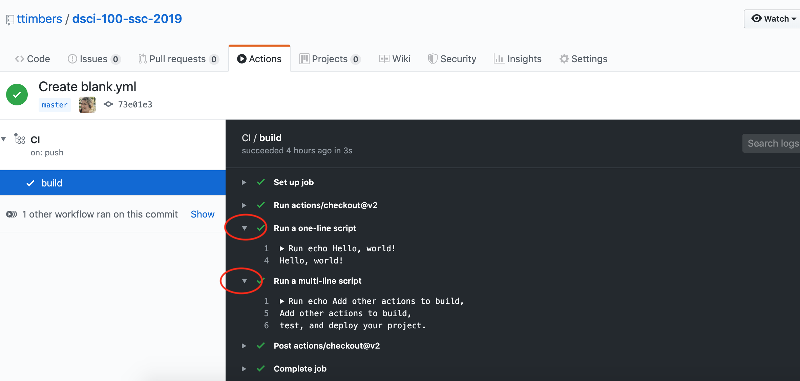

## DSCI 524 - Collaborative Software Development

### Lecture 5: Introductions to Continuous Integration (CI) & GitHub Actions

#### 2020-03-09

## Lecture 5 learning objectives:
By the end of this lecture, students should be able to:
- [Define continuous integration testing](#Continuous-Integration-(CI))
- [Explain why continuous integration testing is superior to manually running tests](#Why-use-CI-+-automated-testing)
- [Define the following key concepts that underlie GitHub Actions:](#GitHub-actions)
    - Actions
    - Workflow
    - Event
    - Runner
    - Job
    - Step
- [Store and use GitHub Actions credentials safely via GitHub Secrets](#Storing-and-use-GitHub-Actions-credentials-safely-via-GitHub-Secrets)
- [Use matrix GitHub Actions workflows to reduce workflow redundancy](#Matrix-workflows)
- [Use GitHub Actions to set-up automated running of tests by `pytest` upon push to the master branch](#Setting-up-GitHub-Actions-workflows-with-Python)
- [Use GitHub Actions to set-up automated running of tests by `testthat` upon push to the master branch](#Setting-up-GitHub-Actions-workflows-with-R)

## Continuous Integration (CI)

Defined as the practice of **frequently** integrating code (*e.g.*, several times a day) changes from contributors to a shared repository. Often the submission of code to the shared repository is combined with automated testing (and other things, such as style checking) to increase code dependability and quality.

### Why use CI + automated testing

- detects errors sooner
- reduces the amount of code to be examined when debugging
- facilitates merging
- ensures new code additions do not introduce errors

## GitHub actions

A tool and service for automating software development tasks, located in the same place where you already store your code.

### Key concepts:
**Actions:** Individual tasks you want to perform.

**Workflow:** A collection of actions (specified together in one file).

**Event:** Something that triggers the running of a workflow.

**Runner**: A machine that can run the Github Action(s).

**Job**: A set of steps executed on the same runner.

**Step**: A set of commands or actions which a job executes.

### Examples of GitHub Actions
 
You have already interacted with GitHub Actions in this class! We used it to:

1. Generate the issues in the [`mds-homework` repo](https://github.com/ubc-mds/mds-homework) upon push to the "create" branch: <https://github.com/UBC-MDS/mds-homework/blob/master/.github/workflows/create_issues.yml>

2. Generate a pull request in the [`review-my-pull-request` repo](https://github.com/ttimbers/review-my-pull-request) upon push to the "pr" branch: : <https://github.com/ttimbers/review-my-pull-request/blob/master/.github/workflows/pr.yml>

### Polls made easier!

I am still trying to find a better way to see where everyone is during these exercises, let's try answering them from inside your lecture notes today (thanks to Firas for figuring this out!):


```python
import IPython
```


```python
poll = "https://app.sli.do/event/wim3yyiz"
IPython.display.IFrame(poll, 500, 700)
```


<iframe
    width="500"
    height="700"
    src="https://app.sli.do/event/wim3yyiz"
    frameborder="0"
    allowfullscreen
></iframe>


### Exercise: Getting to know GitHub Actions workflows

We are going to each create our own GitHub Actions workflow. This workflow is a very simple toy example where we run some `echo` shell commands to print things to the runner's terminal.

#### Steps:

1. Create a new public **GitHub.com** repository.

2. Click on the "Actions" tab

3. Click on the first "Set up this workflow" button

    

4. Click on the two green commit buttons to add this workflow file

5. Go to the "Actions" tab and look at the build logs by following these instructions:

    Click on the message associated with the event that created the action:
    
    
    
    Click on the build link:
    
    
    
    Click on the arrow inside the build logs to expand a section and see the output of the action:
    
    


**When you are done step #5 indicate so on the [sli.do](https://www.sli.do) poll (`#524-L05`).**


```python
poll = "https://app.sli.do/event/wim3yyiz/embed/polls/59a3bdc4-0bec-46d5-a861-eaa83d05907a"
IPython.display.IFrame(poll, 500, 500)
```


<iframe
    width="500"
    height="500"
    src="https://app.sli.do/event/wim3yyiz/embed/polls/59a3bdc4-0bec-46d5-a861-eaa83d05907a"
    frameborder="0"
    allowfullscreen
></iframe>


### GitHub Actions workflow file:

A `YAML` file that lives in the `.github/workflows` directory or your repository which speciies your workflow. 

```
# This is a basic workflow to help you get started with Actions

name: CI

# Controls when the action will run. Triggers the workflow on push or pull request 
# events but only for the master branch
on:
  push:
    branches: [ master ]
  pull_request:
    branches: [ master ]

# A workflow run is made up of one or more jobs that can run sequentially or in parallel
jobs:
  # This workflow contains a single job called "build"
  build:
    # The type of runner that the job will run on
    runs-on: ubuntu-latest

    # Steps represent a sequence of tasks that will be executed as part of the job
    steps:
    # Checks-out your repository under $GITHUB_WORKSPACE, so your job can access it
    - uses: actions/checkout@v2

    # Runs a single command using the runners shell
    - name: Run a one-line script
      run: echo Hello, world!

    # Runs a set of commands using the runners shell
    - name: Run a multi-line script
      run: |
        echo Add other actions to build,
        echo test, and deploy your project.
```

The file above has:
- one job
- 3 steps
- the type of runner is ubuntu
- the first step uses an action, and the following two steps run commands

### Commands vs actions

Steps can consist commands or actions. Let's spend some time to discuss what each of these are and how they differ.

### Commands

Steps that use commands look like the one shown below. They consist of a `name` and a `run` parameter. The commands listed after `run` are run in the runner's shell:

```
- name: Run a one-line script
      run: echo Hello, world!
```

As shown in the file above, we can run multiple commands in a step using the `|` character:
```
- name: Run a multi-line script
      run: |
        echo Add other actions to build,
        echo test, and deploy your project.
```

### Actions

Steps that use actions look like the one shown below (which builds and publishes Docker containers). They always have a `uses` parameter, and often also have `name` and `with` parameters. The `uses` parameter specifies which action to use, and the `with` parameters provide arguments to those actions.

```
- name: Publish to Registry
      uses: elgohr/Publish-Docker-Github-Action@master
      with:
        name: myDocker/repository
        username: ${{ secrets.DOCKER_USERNAME }}
        password: ${{ secrets.DOCKER_PASSWORD }}
```

Actions commonly perform one task in a workflow. There are two ways to build actions, either using JavaScript or by creating a Docker container that runs a shell script. For the latter such actions are defined by:
- a Dockerfile
- a shell script to run inside the Docker container

For example, for the action above see its:
- [Dockerfile](https://github.com/elgohr/Publish-Docker-Github-Action/blob/master/Dockerfile)
- [endpoint.sh script](https://github.com/elgohr/Publish-Docker-Github-Action/blob/master/entrypoint.sh)
- [GitHub repo](https://github.com/elgohr/Publish-Docker-Github-Action)

Read the docs here to learn how to build your own Docker container GitHub action: <https://help.github.com/en/actions/building-actions/creating-a-docker-container-action>

Read the docs here to learn how to build your own JavaScript GitHub action:
<https://help.github.com/en/actions/building-actions/creating-a-javascript-action>

## Case study: a simplified version of our Python package `build.yml` workflow:

- Let's break down a simplified version of our [`build.yml`](https://github.com/UBC-MDS/cookiecutter-ubc-mds/blob/master/%7B%7Bcookiecutter.project_slug%7D%7D/.github/workflows/build.yml) workflow file to start to better understand a real use case of GitHub Actions.

```
name: build

on: [push, pull_request]

jobs:
  build:
    runs-on: ubuntu-latest
    steps:
    - uses: actions/checkout@v2
    - name: Set up Python 3.7
      uses: actions/setup-python@v1
      with:
        python-version: 3.7
    - name: Install dependencies
      run: |
        pip install poetry
        poetry install
    - name: Check style
      run: poetry run flake8 --exclude=docs*
    - name: Test with pytest
      run: |
        poetry run pytest --cov=./ --cov-report=xml
    - name: Upload coverage to Codecov  
      uses: codecov/codecov-action@v1
      with:
        token: ${{ secrets.CODECOV_TOKEN }}
        file: ./coverage.xml
        flags: unittests
        name: codecov-umbrella
        yml: ./codecov.yml 
        fail_ci_if_error: true
```

### Exercise: Orientating ourselves with the `build.yml` workflow

Let's answer the following questions to start better understanding the `build.yml` workflow.

1. How many jobs are there?

2. How many steps are there?

3. What which steps are actions and which are commands

4. What is the type of runner


```python
poll = "https://app.sli.do/event/wim3yyiz"
IPython.display.IFrame(poll, 500, 700)
```


<iframe
    width="500"
    height="700"
    src="https://app.sli.do/event/wim3yyiz"
    frameborder="0"
    allowfullscreen
></iframe>


## Storing and use GitHub Actions credentials safely via GitHub Secrets

Some of the tasks we want to do in our workflows require authentication. However, the whole point of this is to automate this process - so how can we do that without sharing our authentication tokens, usernames or passwords in our workflow files?

GitHub Secrets is the solution to this! 

GitHub Secrets are encrypted environment variables that are used only with GitHub Actions, and specified on a repository-by-repository basis. They can be accessed in a workflow file via: `${{ secrets.SECRET_NAME }}`

See GitHub's help docs for how to do this: <https://help.github.com/en/actions/configuring-and-managing-workflows/creating-and-storing-encrypted-secrets>

### Exercise: add a secret to your `foocat` GitHub repository

Let's learn how to add secrets to a GitHub repository. We'll do this by adding our `CODECOV_TOKEN` as a secret to our `foocat` GitHub repository so that we can report our coverage via a nice shiny button on our repo's README.

#### Steps:

1. Log into [codecov.io](https://codecov.io/) using GitHub to authenticate

2. Link your packages GitHub repo to [codecov.io](https://codecov.io/)

3. Copy the [codecov.io](https://codecov.io/) token for that repo from [codecov.io](https://codecov.io/)

4. On the "Settings" tab of GitHub, click on "Secrets"

5. Click "Add a new secret"

6. Add `CODECOV_TOKEN` as the secret name, and paste your token (which you copied from [codecov.io](https://codecov.io/)) as the value.

**When you are done step #6 indicate so on the [sli.do](https://www.sli.do) poll (`#524-L05`).**


```python
poll = "https://app.sli.do/event/wim3yyiz"
IPython.display.IFrame(poll, 500, 700)
```


<iframe
    width="500"
    height="700"
    src="https://app.sli.do/event/wim3yyiz"
    frameborder="0"
    allowfullscreen
></iframe>


## Authenticating with the `GITHUB_TOKEN`

What if you need to do Git/GitHub things in your workflow? Like checkout your files to run the tests? Create a release? Open an issue? To help with this GitHub automatically (i.e., you do not need to create this secret) creates a secret named `GITHUB_TOKEN` that you can access and use in your workflow. You access this token in your workflow file via:

```
${{ secrets.GITHUB_TOKEN }}
```

## Creating and accessing environment variables in GitHub Actions

Sometimes our commands or actions need environment variables. In both of these scenarios, we create environment variables and access them within a step via: 

```
steps:
  - name: Hello env vars
    run: echo $VARIABLE_NAME1 $VARIABLE_NAME2
    env:
      VARIABLE_NAME1: <variable_value1>
      VARIABLE_NAME2: <variable_value2>
```


## Matrix workflows

We don't want our software to just work on one operating system, or just one version of Python or R. Ideally it is compatible with the three major operating systems as well as a couple versions of the programming language it was written it.

How do we ensure this? Well, we could have several GitHub Action workflows, each of which runs the job on a different version of Python, on a different operating system. However, there would be a lot of redundancy in those workflows, with the only differences between them being the operating system of the runner and the version of Python.

A more efficient way to do this with GitHub Actions workflows is to use matrix workflows. In these workflows, we use a matrix variable, which we specify as: 

```
strategy:
  matrix:
    <variable_name>: [<value1>, <value2>]
```

which we can refer to in the workflow steps as:

```
${{ matrix.<variable_name> }}
```

When we do this, GitHub Actions runs multiple jobs, one for each of the values in the matrix variable.

### Exercise: in English, what does our `build.yml` file do?

Now that we have some understanding of GitHub Actions workflows, let's use that knowledge to write in English what each of the steps do in this more complicated version of the workflow found in  `build.yml`.

```
name: build

on: [push, pull_request]

jobs:
  build:
    runs-on: ${{ matrix.os }}
    strategy:
      matrix:
        os: [ubuntu-latest, macos-latest, windows-latest]
        python-version: [3.7, 3.8]
    steps:
    - uses: actions/checkout@v2
    - name: Set up Python ${{ matrix.python-version }}
      uses: actions/setup-python@v1
      with:
        python-version: ${{ matrix.python-version }}
    - name: Install dependencies
      run: |
        pip install poetry
        poetry install
    - name: Check style
      run: poetry run flake8 --exclude=docs*
    - name: Test with pytest
      run: |
        poetry run pytest --cov=./ --cov-report=xml
    - name: Upload coverage to Codecov  
      uses: codecov/codecov-action@v1
      with:
        token: ${{ secrets.CODECOV_TOKEN }}
        file: ./coverage.xml
        flags: unittests
        name: codecov-umbrella
        yml: ./codecov.yml 
        fail_ci_if_error: true
```

#### Steps in English:

1. checking out the files of the repository to the runner (last commit)

2. Set up and install Python on the runner

3. Use poetry to install dependencies and the package

4. Check for adherence to pep 8 style

5. Run tests and check coverage, generate a coverage report

6. Send the coverage report to codecov.io

#### How many jobs are run? What does each do?

- 6

## Setting up GitHub Actions workflows with Python

Your task should already be done, except for adding the GitHub Secrets and linking your GitHub reposiroty to codecov.io. How so? When you used the UBC-MDS Cookiecutter template to create your package skeleton, it wrote you two workflow files:
- `build.yml`
- `release.yml`

To make the `build.yml` workflow run without fail, you will need to ensure your:
- the following package development dependencies have been added to `pyproject.toml` via `poetry add --dev`:
    - `pytest` 
    - `pytest-cov` 
    - `codecov` 
    - `flake8` 
- all tests pass 
- code adhere's to PEP 8 standards 
- your packages GitHub repo has been linked to <https://codecov.io/> and added your [codecov.io](https://codecov.io/) token for that repo as a GitHub Secret named `CODECOV_TOKEN`.

> We will talk about `release.yml` next class.

## Setting up GitHub Actions workflows with Python

The README of the UBC-MDS Cookiecutter template repo has a quickstart instruction that should help you get this all set-up: https://github.com/UBC-MDS/cookiecutter-ubc-mds#quickstart

## Automated style checking in Python via `flake8`

- Python code style is supposed to follow [PEP 8](https://www.python.org/dev/peps/pep-0008/)

- `flake8` is an automated tool that reports which lines are violating flake8 and gives hints on how to fix them.

- `flake8` is part of `build.yml`, amd thus if your code does not adhere to PEP 8, then your build will fail. 

- Good practice to use an IDE that does Python linting when writing your code, and/or run `flake8` at the command line in the root of your repo to check style before pushing to your branch.

### Using `flake8` to check style

- add `flake8` as a dev dependency of your package via Poerty via:
    ```
    poetry add --dev flake8
    ```

- to run `flake8` for your package code (but to ignore your docs), type:
    ```
    poetry run flake8 --exclude=docs*
    ```

## Setting up GitHub Actions workflows with R

The dev version of `usethis` has functions that will let you set-up your CI using GitHub Actions with ease! Here's a quickstart guide below, and more details can be found in the [Github actions with R](https://ropenscilabs.github.io/actions_sandbox/) book.

1. Add the `covr` package as a suggested dependendency to your package via: `usethis::use_package("covr", type = "Suggests)`

2. Tell your package where it's GitHub repo is located via: `usethis::use_github_links()`

3. Add a GitHub Actions workflow that runs a comprehensive CI check across the major operating systems via: `usethis::use_github_action_check_full()`

4. Link your R package GitHub repo with [codecov.io](https://codecov.io/)

5. Copy the [codecov.io](https://codecov.io/) token for that repo from [codecov.io](https://codecov.io/) and add that as a GitHub Secret named `CODECOV_TOKEN`

6. Add the [codecov.io](https://codecov.io/) badge markdown syntax to your `README.Rmd` and knit to render the `README.md` file.

7. Push your local changes to GitHub and sit back and watch the magic happen ✨


## What's next?

- Setting up GitHub Actions workflows for CI with R
- Continous development with GitHub Actions workflows in Python (including version bumping & semantic release)
- Package-level documentation
- Publishing your package on the package indices

## Resources:

### Curated list of awesome actions to use on GitHub 🎉

- <https://github.com/sdras/awesome-actions>

### GitHub Actions for the R community
- <https://github.com/r-lib/actions>
